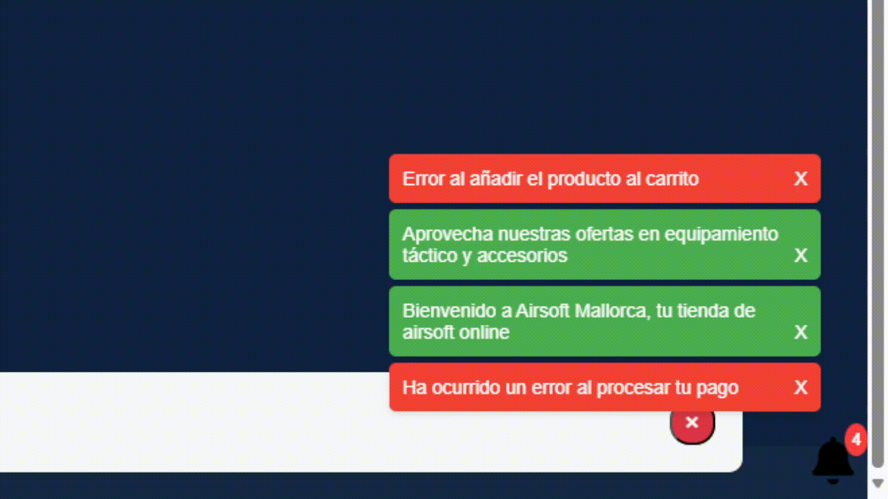
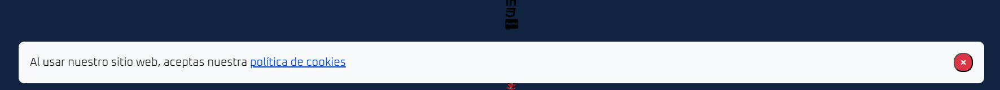
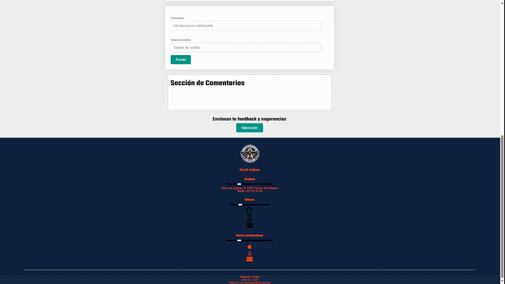

# Índice

1. [Introducción](#introducción)
2. [División del trabajo](#división-del-trabajo)
3. [Scripts](#scripts)
   1. [Formulario de contacto interactivo](#formulario-de-contacto-interactivo)
   2. [Carga dinámica de contenido](#carga-dinámica-de-contenido)
   3. [Notificaciones emergentes](#notificaciones-emergentes)
   4. [Encuestas/Valoraciones interactivas](#encuestasvaloraciones-interactivas)
   5. [Cambios de estilo](#cambios-de-estilo)
   6. [Imágenes](#imágenes)
   7. [Dado](#Dado-descuento)
4. [Tecnologías utilizadas](#tecnologías-utilizadas)
5. [Comentarios adicionales](#comentarios-adicionales)
6. [Scripts Enteros](#scripts-enteros)


# Introducción

Antonio Catalan
Alejandro Carpio

LLM - 2ºn Trimestre - Página responsive con Javascript

## Interactividad de la página

De una práctica a otra la página ha ganado mucho en interactividad.

Todas las páginas tienen un botón para cambiar el tema, de modo claro a modo oscuro y viceversa.

En la página de la tienda, hay un carrusel de imagenes con botones para navegar entre las imagenes, y en cada producto se puede hacer click para desplegar una galería que muestra la foto del producto a pantalla completa y información adicional.

Hay ventanas emergentes que te dan información sobre los términos y condiciones, las cookies, o unas notificaciones que salen de la campana que te dan información sobre la página, esta información se guarda en local storage para que no vuelva a salir al recargar la página.

En la página de contacto hay varios formularios responsive, en el formulario grande si se completa todo y se valida bien, se añade el comentario de forma dinámica a la página. Abajo del todo hay un botón para enviar una valoración a través de un popup emergente, que permite seleccionar una valoración de 1 a 5 estrellas y enviar un comentario por correo al administrador de la página.


# División del trabajo

Al ser una práctica más enfocada a los scripts, nos hemos dividido más o menos el trabajo a la mitad, aunque al final hemos terminado haciendo los dos un poco de todo.


| Alex |Antonio  |
|--|--|
| Formulario de contacto interactivo + validación |Carga dinámica de contenido  |
|Imagenes  | Notificaciones emergentes |
| Encuestas/valoraciones interactivas |Encuestas/valoraciones interactivas  |
|Cambios de estilo  |  |
| Documentación |Documentación  |


# Scripts

## Formulario de contacto interactivo

Scripts relevantes:

**formularioDinamico.js**
**validacionContraseña.js**

Página relevante:

**contacto.html**

Esta página consiste en dos formularios interactivos y responsives. El primer formulario, es un formulario de contacto el cual tiene diferentes campos para introducir información personal, junto a una foto que simularía una foto de perfil. 

La validación de estos campos se realiza mediante Javascript, utilizando onsubmit return funcionValidación(). Si la validación es correcta el formulario se envía, y su contenido se añade de manera dinámica a la web, en la sección de abajo llamada "Sección de comentarios". 

El siguiente formulario valida una contraseña y un patrón de tarjeta de crédito. A medida que se introduce la contraseña, aparece una sección que antes estaba  oculta, utilizando eventos, como onkeyup y onkeydown que te indica que le falta a la contraseña para ser correcta. Se valida mediante expresiones regulares utilizando test, y añadiendo o quitando clases para estilizar los requisitos de la contraseña. El campo de tarjeta de crédito acepta dos patrones, uno de visa y uno de mastercard, y cuando se envía, si todo es correcto te indica el tipo de tarjeta que has utilizado.

## Funcionalidad de la página:


https://github.com/CarpioAlex/WebV2/assets/147094237/3734b124-67d8-4dbb-b0b2-7959de609b8e


https://github.com/CarpioAlex/WebV2/assets/147094237/c3a7497a-348a-4227-af04-44719419b854


## Carga dinámica de contenido

Scripts relevantes: 

**CargaDinamica.js**

Páginas relevantes:

**tienda.html**

El script CargaDinamica contiene dos funciones principales: `expandirContraerTarjetas` y `mostrarOcultarPopup`. 

### Función  tarjetas interactivas
La primera gestiona la visualización de contenido en tarjetas interactivas, permitiendo a los usuarios expandir o contraer la información. 

### Función términos y condiciones
La segunda función crea un pop-up con términos y condiciones que los usuarios pueden aceptar o cancelar; si se aceptan, el pop-up se oculta y la aceptación se guarda en el almacenamiento local. 


## Notificaciones emergentes

Implementamos un sistema de notificaciones emergentes para informar a los usuarios sobre eventos importantes en tiempo real. El sistema utiliza un contenedor `div` para mostrar las notificaciones y un botón con un icono de campana que permite a los usuarios mostrar u ocultar las notificaciones.



### Cómo Funciona

- Se crea un contenedor `div` que alberga todas las notificaciones.
- Un botón de campana muestra el número actual de notificaciones pendientes.
- Las notificaciones se generan mediante una función `createNotif`, que acepta un mensaje y un tipo (`success` o `error`).
- Cada notificación tiene un botón de cierre que, al hacer clic, la elimina del contenedor y actualiza el contador.
- Un intervalo invoca la función `generateRandomNotif` para crear notificaciones aleatorias cada 30 segundos.
- El botón de campana tiene un evento adjunto que alterna la visibilidad del contenedor de notificaciones.


### Notificación de Cookies

Esta notificación solo se muestra una vez y se oculta permanentemente una vez que el usuario la cierra.


#### Cómo Funciona

- La función `mostrarNotificacionCookies` verifica si el banner de cookies ya se ha mostrado utilizando `localStorage`.
- Si no se ha mostrado, crea un banner con un mensaje y un enlace a la política de cookies.
- Un botón '×' permite cerrar el banner, y guarda el estado en local storage.


## Encuestas/Valoraciones interactivas

En este apartado, hay una encuesta al final de la página contactos, que recibe el feedback del usuario, utilizando un textarea y una serie de estrellas para evaluar la página en una escala del 1 al 5. El resultado se envía por correo al administrador de la página.

Como añadido, los comentarios del formulario de la misma página se agregan de manera dinámica una vez se envían.



### Cómo Funciona

- La función `mostrarVentana` muestra una ventana emergente que contiene la encuesta.
- `iluminarEstrellas` cambía el estilo de la estrella hasta la última en la que se situa el cursor para simular el efecto de selección.
- `enviarValoracion` recoge la valoración y los comentarios del usuario, enviándolos por correo electrónico al administrador del sitio y cerrando la ventana emergente.


## Cambios de estilo

Scripts relevantes: 

**tema.js**

Páginas relevantes:

Todas

En cada página, en el navbar se ha añadido un botón que se llama "Temas" que cambia entre el tema claro, que es el que se tiene por defecto, y el tema oscuro. El script tiene dos cambios de estilo diferentes. Uno que simplemente añade y quita una clase con toggle, para pasar del modo oscuro al modo claro y viceversa, en las páginas más simples, y otra función para las partes más complicadas, como las de "Nosotros" o "Contacto" que utiliza selectores de elementos de JS y el array que generan para cambiar los estilos.

También hemos añadido esos cambios de estilo a los popups de cookies y terminos y condiciones.

## Funcionalidad de la página:


https://github.com/CarpioAlex/WebV2/assets/147094237/757db03c-6fc8-490f-8303-52a4eec72ffd


https://github.com/CarpioAlex/acatalan_acarpio_PracticaB2Javascript/assets/147094237/0079dbbb-4cdb-4c64-af0c-38d42bbaa6b0


## Imágenes

Scripts relevantes: 

**imagenes.js**

Páginas relevantes:

**tienda.html**

Aquí hay dos scripts diferentes. Un carrusel de imágenes y una galería de imagenes interactiva.

El carrusel consiste en un contenedor con imagenes, que van con indices de 0 a 300, se recorre el array que contiene el elemento, y se multiplica el indice del array por 100, de manera que la primera imagen será 0%, 100%, 200% y 300%, y se utiliza la propiedad translateX por esos valores, para hacer el efecto de que las imágenes se "deslizan". Esas funciones se asignan a un botón para adelantar y retroceder.

El siguiente script consiste en una especie de galería de imagenes, que permite hacer click a un producto de la tienda, y verlo en pantalla completa junto a un texto y un botón de cerrar.

Estos elementos en un principio no existen en la web, si no que se crean con create.Element, y el botón de cerrar hace que desaparezcan del DOM hasta que se vuelve a hacer click.


https://github.com/CarpioAlex/WebV2/assets/147094237/8bcf693c-4dc0-4d50-bda9-3ddd5a987a7c

### Dado descuento

Hemos aprovechado el script de la Tasca 4 de crear un dado para añadirlo a la página como extra. En la página "Tienda" hay un botón llamado Dado, que llama a las funciones correspondientes, y crea un dado que empieza a girar, según lo que saque ese dado después se aplica un descuento a los precios de la página. Este script combina varias categorías, ya que el dado se añade de forma dinámica a la web, y muestra diferentes pop ups. (Este no lo hemos comentado porque es un extra y lo hemos hecho para programar un poco.)


https://github.com/CarpioAlex/acatalan_acarpio_PracticaB2Javascript/assets/147094237/5ccef694-81a5-4a6f-94b7-9921f3a0e5fa


Todas
# Tecnologías utilizadas

### Git

Hemos utilizado git para manejar el control de versiones y el trabajo en equipo asimétrico.

### Visual Studio Code

IDE utilizado para programar los scripts y el HTML/CSS de la página.

### Software de captura de imágenes/video

Distintos softwares para realizar las capturas de pantalla y vídeos para la documentación, como la herramienta de recortes de Windows, o OBS (Open Broadcasting Software) para capturar vídeos de demostración.

### Unsplashed

Hosting de imagenes que permite enlazar imagenes que cambian de manera aleatoria cada vez que se recarga la página, utilizada sobretodo en el carrusel.


### Bing Chat Copilot

Herramienta de IA para facilitar las tareas tediosas, como el generar texto para los párrafos de la web.

### Font Awesome
Para emplear iconos vectoriales tales como el de la campana de notificaciones.

# Scripts enteros
   ## Formulario de contacto interactivo
   ```js
         /* Script para mostrar los contenidos del formulario dinámicamente, y enseñar un popup al enviar. */


      // Primero, accedemos al formulario usando su ID
      var formulario = document.getElementById('formulario1');

      // Luego, podemos acceder a los valores de cada campo del formulario y guardarlos en variables
      var nombre = formulario.nombre;
      var apellidos = formulario.apellidos;
      var avatar = formulario.avatar;
      var sexoH = formulario.sexoH.checked;
      var sexoM = formulario.sexoM.checked;
      var sexoO = formulario.sexoO.checked;
      var email = formulario.email;
      var numero = formulario.numero;
      var condiciones = formulario.condiciones.checked;
      var mensaje = formulario.mensaje;
      var motivo = formulario.motivo;


      function añadirComentario() {


         // Crear elementos antes de añadirlos al DOM

         var li = document.createElement('li');
         var imagenAvatar = document.createElement('img');
         var div = document.createElement('div');
         var h3NombreApellidos = document.createElement('h3');
         var pEmail = document.createElement('p');
         var pTelefono = document.createElement('p');
         var pMotivo = document.createElement('p');
         var pMensaje = document.createElement('p');


         // Rellenar los valores

         h3NombreApellidos.textContent = nombre.value + ' ' + apellidos.value;
         pEmail.textContent = 'Email: ' + email.value;
         pTelefono.textContent = 'Número de contacto: ' + numero.value;
         pMotivo.textContent = 'Motivo de contacto: ' + motivo.value;
         pMensaje.textContent = mensaje.value;

         imagenAvatar.src = avatar.value;
         imagenAvatar.width = 50;
         imagenAvatar.height = 50;


         // Añadir los elementos al div del comentario.

         div.appendChild(h3NombreApellidos);
         div.appendChild(pEmail);
         div.appendChild(pTelefono);
         div.appendChild(pMotivo);
         div.appendChild(pMensaje);
         li.appendChild(imagenAvatar);
         li.appendChild(div);

         // Añadir el comentario a la lista de comentarios

         document.getElementById('lista-comentarios').appendChild(li);

      }

      function validarFormulario() {

         // Expresiones para validar
         var regexUrl = /^https?:\/\/.*\.(jpg|png)$/;
         var regexNombre = /^[a-zA-Z\s]+/;
         var regexEmail = /^[a-zA-Z0-9._%+-]+@[a-zA-Z0-9.-]+\.[a-zA-Z]{2,}$/;
         var regexNumero = /^[0-9]{9}$/; 

         // Tests para ver si finalmente se validará.

         if (!regexNombre.test(nombre.value)) {
            alert('El nombre solo puede contener letras y espacios.');
            return false;
            }
         
            if (!regexNombre.test(apellidos.value)) {
            alert('Los apellidos solo pueden contener letras y espacios.');
            return false;
            }
         
            if (!regexEmail.test(email.value)) {
            alert('Introduce un email válido.');
            return false;
            }
         
            if (!regexNumero.test(numero.value)) {
            alert('9 Números para el móvil.');
            return false;
            }

            if (!regexUrl.test(avatar.value)) {
            alert('Solo funciona con imagenes acabadas en .jpg o .png,');
            return false;
            }

            else {
            añadirComentario()
            }

      }


      function lanzarComentario() {
         if (validarFormulario()) {
            añadirComentario()
         }
      }


// Coger cada campo que me interese con document.getElementById y asignarlo a una variable.

var entradaContraseña = document.getElementById('contraseña')
var entradaMayus = document.getElementById('mayus')
var entradaMinus = document.getElementById('minus')
var entradaNumeros = document.getElementById('numeros')
var entradaSimbolos = document.getElementById('simbolo')
var entradaTamaño = document.getElementById('tamaño')
var botonContraseña = document.getElementById('botonContraseña')
var leyenda = document.getElementById('leyenda')

var botonPass = document.getElementById('botonContraseña')

var tarjeta = document.getElementById("tarjeta").value;
var regexVisa = /^4[0-9]{12}(?:[0-9]{3})?$/;
var regexMasterCard = /^5[1-5][0-9]{14}$/;


// Onfocus = al hacer click en el campo, onblur al perder el focus. 

entradaContraseña.onfocus = function() {
    leyenda.style.display = "block";
}
entradaContraseña.onblur = function() {
    leyenda.style.display = "none";
}


// Empieza la validación aquí y cambia la clase según si está bien o mal la validación. El botón de enviar el formulario queda disabled hasta que se cumplan todas las condiciones.


    entradaContraseña.onkeyup = function() {
        var minusculas = /[a-z]/g;
        var mayusculas = /[A-Z]/g;
        var numeros = /[0-9]/g;
        var simbolos = /[-!$%^&*()_+|~=`{}\[\]:";'<>?,.\/]/g;
    
        // Verificar minúsculas
        if (minusculas.test(entradaContraseña.value)) {
            entradaMinus.classList.remove('mal');
            entradaMinus.classList.add('bien');
        } else {
            entradaMinus.classList.remove('bien');
            entradaMinus.classList.add('mal');
        }
    
        // Verificar mayúsculas
        if (mayusculas.test(entradaContraseña.value)) {
            entradaMayus.classList.remove('mal');
            entradaMayus.classList.add('bien');
        } else {
            entradaMayus.classList.remove('bien');
            entradaMayus.classList.add('mal');
        }
    
        // Verificar números
        if (numeros.test(entradaContraseña.value)) {
            entradaNumeros.classList.remove('mal');
            entradaNumeros.classList.add('bien');
        } else {
            entradaNumeros.classList.remove('bien');
            entradaNumeros.classList.add('mal');
        }
    
        // Verificar símbolos
        if (simbolos.test(entradaContraseña.value)) {
            entradaSimbolos.classList.remove('mal');
            entradaSimbolos.classList.add('bien');
        } else {
            entradaSimbolos.classList.remove('bien');
            entradaSimbolos.classList.add('mal');
        }
    
        // Verificar tamaño
        if (entradaContraseña.value.length >=8) {
            entradaTamaño.classList.remove('mal');
            entradaTamaño.classList.add('bien');
        } else {
            entradaTamaño.classList.remove('bien');
            entradaTamaño.classList.add('mal');
        }
    }


    // Función que valida el formulario de contraseña como tal. Contiene la validación y la manipulación de las clases para ver que te falta por introducir a medida que vas escribiendo.

    function validarContraseña() {
        var tarjeta = document.getElementById('tarjeta').value;
        var iconoTarjeta = document.getElementById('icono-tarjeta');
        var regexVisa = /^4[0-9]{12}(?:[0-9]{3})?$/;
        var regexMasterCard = /^5[1-5][0-9]{14}$/;
    
        if (entradaMinus.classList.contains('bien') &&
            entradaMayus.classList.contains('bien') &&
            entradaNumeros.classList.contains('bien') &&
            entradaSimbolos.classList.contains('bien') &&
            entradaTamaño.classList.contains('bien')) {
            if (regexVisa.test(tarjeta)) {
                iconoTarjeta.innerHTML = '<i class="fa-brands fa-cc-visa"></i>';
                alert('Formulario enviado. Tu tarjeta introducida es: Visa');
                return true;
            } else if (regexMasterCard.test(tarjeta)) {
                iconoTarjeta.innerHTML = '<i class="fa-brands fa-cc-mastercard"></i>';
                alert('Formulario enviado. Tu tarjeta introducida es: MasterCard');
                return true;
            }
        } else {
            iconoTarjeta.innerHTML = '';
            alert('Formulario no enviado, revisa el formato de los campos.');
            return false;
        }
    }
    

   ```
   ## Carga dinámica de contenido
   ```js
   // Carga dinámica de contenido:

// Mostrar/ocultar informaciones que inicialmente estaban ocultas/visibles.

// Función para expandir y contraer las tarjetas
function expandirContraerTarjetas() {
    // Obtener todas las tarjetas
    var tarjetas = document.getElementsByClassName("tarjeta");
    // Recorrer cada tarjeta
    for (var i = 0; i < tarjetas.length; i++) {
      // Obtener el elemento tarjeta_cuerpo
      var cuerpo = tarjetas[i].getElementsByClassName("tarjeta_cuerpo")[0];
      cuerpo.style.display = "none";
      // Crear un elemento botón
      var boton = document.createElement("button");
      boton.className = "boton_expandir";
      // Crear un elemento span para el icono
      var icono = document.createElement("span");
      icono.className = "fa";
      icono.classList.add("fa-angle-down");
      // Añadir el span al botón
      boton.appendChild(icono);
      // Añadir un evento de clic al botón
      boton.addEventListener("click", function() {
        // Obtener el elemento tarjeta_cuerpo asociado al botón
        var cuerpo = this.parentNode.getElementsByClassName("tarjeta_cuerpo")[0];
        // Alternar entre mostrar y ocultar el elemento tarjeta_cuerpo
        if (cuerpo.style.display === "none") {
          cuerpo.style.display = "flex";
          // Cambiar la clase del icono a fa-angle-up para mostrar una flecha hacia arriba
          this.firstChild.classList.replace("fa-angle-down", "fa-angle-up");
        } else {
          cuerpo.style.display = "none";
          // Cambiar la clase del icono a fa-angle-down para mostrar una flecha hacia abajo
          this.firstChild.classList.replace("fa-angle-up", "fa-angle-down");
        }
      });
      // Añadir el botón al elemento tarjeta_inicio
      // var inicio = tarjetas[i].getElementsByClassName("tarjeta_inicio")[0];
      tarjetas[i].appendChild(boton);
    }
}

// Función para mostrar y ocultar el pop up con los términos y condiciones
function mostrarOcultarPopup() {
    // Crear un elemento div para el pop up
    var popup = document.createElement("div");
    // Añadir la clase popup al div
    popup.className = "popup";
    // Crear un elemento div para el contenido del pop up
    var popupContent = document.createElement("div");
    // Añadir la clase popup-content al div
    popupContent.className = "popup-content";
    // Añadir el contenido del pop up al div
    popupContent.id = "popupContent-tos"
    popupContent.innerHTML = `
    <h4>Términos y condiciones</h4>
    <p>Al usar esta página web, usted acepta los siguientes términos y condiciones:</p>
    <ul>
      <li>Esta página web es solo para fines educativos y recreativos.</li>
      <li>No nos hacemos responsables de ningún daño o perjuicio que pueda sufrir por el uso de esta página web.</li>
      <li>No garantizamos la exactitud, veracidad, actualidad o calidad de la información o el contenido de esta página web.</li>
      <li>Esta página web puede contener enlaces a otras páginas web que no están bajo nuestro control ni supervisión.</li>
      <li>Usted es el único responsable de cumplir con las leyes y normas aplicables al usar esta página web.</li>
    </ul>
    <div class="buttons">
    <button id="aceptar">Aceptar</button>
    <button id="cancelar">Cancelar</button>
    </div>
    `;
    // Añadir el div del contenido al div del pop up
    popup.appendChild(popupContent);
    // Añadir el div del pop up al cuerpo de la página
    document.body.appendChild(popup);
    // Obtener el botón de aceptar
    var aceptar = document.getElementById("aceptar");
    // Añadir un evento de clic al botón de aceptar
    aceptar.addEventListener("click", function() {
      // Ocultar el pop up
      popup.style.display = "none";
      // Guardar la aceptación del usuario en el almacenamiento local
      localStorage.setItem("aceptado", "true");
    });
    // Obtener el botón de cancelar
    var cancelar = document.getElementById("cancelar");
    // Añadir un evento de clic al botón de cancelar
    cancelar.addEventListener("click", function() {

      window.location.href = "https://www.google.com/";
    });
    // Comprobar si el usuario ya ha aceptado los términos y condiciones
    var aceptado = localStorage.getItem("aceptado") === "true";
    // Si el usuario ya ha aceptado, ocultar el pop up
    if (aceptado) {
      popup.style.display = "none";
    }
}   

// Llamar a las funciones cuando se cargue la página
expandirContraerTarjetas()
mostrarOcultarPopup()
   ```
   ## Notificaciones emergentes
   ```js
// Notificaciones emergentes:

// Crea notificaciones emergentes para proporcionar retroalimentación al usuario.

// Crea un contenedor para las notificaciones
let notifContainer = document.createElement("div");
notifContainer.id = "notif-container";
notifContainer.style.position = "fixed";
notifContainer.style.bottom = "50px";
notifContainer.style.right = "20px";
notifContainer.style.zIndex = "9999";
notifContainer.style.padding = "10px";
notifContainer.style.display = "none"; // Oculta el contenedor por defecto
notifContainer.style.overflowY = "auto"; // Permite el desplazamiento vertical
notifContainer.style.maxHeight = "300px"; // Limita la altura máxima del contenedor
document.body.appendChild(notifContainer);

// Crea un botón con un icono de campana
let bellButton = document.createElement("button");
bellButton.id = "bell-button";
bellButton.style.position = "fixed";
bellButton.style.bottom = "10px";
bellButton.style.right = "10px";
bellButton.style.zIndex = "9999";
bellButton.style.backgroundColor = "transparent";
bellButton.style.border = "none";
bellButton.style.cursor = "pointer";
bellButton.innerHTML = "<i class='fa fa-bell' style='font-size: 36px'></i>";
document.body.appendChild(bellButton);

// Crea un contador para el botón
let notifCount = document.createElement("span");
notifCount.id = "notif-count";
notifCount.style.position = "absolute";
notifCount.style.top = "-10px";
notifCount.style.right = "-10px";
notifCount.style.backgroundColor = "#fa3e3e";
notifCount.style.color = "white";
notifCount.style.borderRadius = "50%";
notifCount.style.padding = "5px";
notifCount.style.fontFamily = "Arial, sans-serif";
notifCount.style.fontSize = "12px";
notifCount.style.fontWeight = "bold";
notifCount.style.boxShadow = "0 2px 4px rgba(0,0,0,0.1)";
notifCount.innerText = "0"; // Inicializa el contador a 0
bellButton.appendChild(notifCount);

// Crea una función para generar una notificación
function createNotif(message, type) {
    // Crea un elemento div para la notificación
    let notif = document.createElement("div");
    notif.className = "notif";
    notif.style.backgroundColor = type === "success" ? "#4CAF50" : "#F44336";
    notif.style.color = "white";
    notif.style.borderRadius = "5px";
    notif.style.margin = "5px";
    notif.style.padding = "10px";
    notif.style.maxWidth = "300px";
    notif.style.fontFamily = "Arial, sans-serif";
    notif.style.fontSize = "14px";
    notif.style.boxShadow = "0 2px 4px rgba(0,0,0,0.1)";

    // Crea un elemento span para el mensaje
    let notifMessage = document.createElement("span");
    notifMessage.innerText = message;
    notif.appendChild(notifMessage);

    // Crea un elemento span para el botón de cerrar
    let notifClose = document.createElement("span");
    notifClose.innerText = "  ×";
    notifClose.style.float = "right";
    notifClose.style.cursor = "pointer";
    notifClose.addEventListener("click", function () {
        // Elimina la notificación del contenedor
        notifContainer.removeChild(notif);
        // Actualiza el contador
        let count = parseInt(notifCount.innerText);
        count--;
        notifCount.innerText = count;
        // Si no hay más notificaciones, oculta el contenedor
        if (count === 0) {
            notifContainer.style.display = "none";
        }
    });
    notif.appendChild(notifClose);

    // Añade la notificación al contenedor
    notifContainer.appendChild(notif);

    // Actualiza el contador
    let count = parseInt(notifCount.innerText);
    count++;
    notifCount.innerText = count;

    // Muestra el contenedor solo en la primera notificación
    if (count == 1) {
        notifContainer.style.display = "block";
    }
}

// Crea un array de mensajes de ejemplo relacionados con una tienda de airsoft
let success_messages = [
    "Bienvenido a Airsoft Mallorca, tu tienda de airsoft online",
    "Aprovecha nuestras ofertas en equipamiento táctico y accesorios",
    "Has recibido un cupón de descuento del 10% en tu próxima compra",
    "Has completado tu pedido con éxito"
];

let error_messages = [
    "Ha ocurrido un error al procesar tu pago",
    "Error al confirmar el pedido",
    "Error al consultar el estado del envío",
    "Error al añadir el producto al carrito"
];

// Crea un array de tipos de ejemplo
let types = ["success", "error"];

// Crea una función para generar notificaciones aleatorias
function generateRandomNotif() {
    // Elige un tipo y un mensaje al azar
    let type = types[Math.floor(Math.random() * types.length)];
    let message = type === "success" ? success_messages[Math.floor(Math.random() * success_messages.length)] : error_messages[Math.floor(Math.random() * error_messages.length)];

    // Crea la notificación con el mensaje y el tipo elegidos
    createNotif(message, type);
}

// Intervalo para repetir la función de generar notificaciones
setInterval(generateRandomNotif, 30000);

// Añade un evento al botón para mostrar u ocultar las notificaciones
bellButton.addEventListener("click", function () {
    // Si el contenedor está visible, lo oculta
    if (notifContainer.style.display === "block") {
        notifContainer.style.display = "none";
    }
    // Si el contenedor está oculto, lo muestra
    else {
        notifContainer.style.display = "block";
    }
});


function mostrarNotificacionCookies() {
    if (!localStorage.getItem('cookieBannerDisplayed')) {
      // Crear elementos
      var banner = document.createElement('div');
      var paragraph = document.createElement('p');
      var button = document.createElement('button');
      var link = document.createElement('a');
      banner.id = "cookieBanner"
      // Establecer contenido y atributos
      link.href = '#politica-de-cookies'; // Enlace a la política de cookies
      link.innerText = 'política de cookies';
      link.style.color = '#0044cc'; // Establece el color del enlace para que sea visible
      link.style.textDecoration = 'underline'; // Subraya el enlace
      paragraph.innerText = 'Al usar nuestro sitio web, aceptas nuestra ';
      paragraph.appendChild(link);
      button.innerHTML = '×';
      button.onclick = function() {
        banner.style.display = 'none';
        localStorage.setItem('cookieBannerDisplayed', 'true');
      };
  
      // Estilos CSS
      banner.style.position = 'fixed';
      banner.style.bottom = '20px'; 
      banner.style.left = '3%';
      banner.style.right = '10%';
      banner.style.width = '90%'; 
      banner.style.padding = '20px'; 
      banner.style.display = 'flex';
      banner.style.alignItems = 'center';
      banner.style.justifyContent = 'space-between';
      banner.style.backgroundColor = '#f8f9fa';
      banner.style.fontSize = "20px"
      banner.style.borderRadius = '10px'; // Esquinas más redondeadas
      banner.style.boxShadow = '0 4px 6px rgba(0, 0, 0, 0.1)';
      banner.style.zIndex = '1000'; // Asegura que el banner esté sobre otros elementos
      banner.style.border = '1px solid black'
      button.style.marginLeft = '20px'; // Añade espacio antes del botón
      button.style.height = '30px'; // Aumenta el tamaño del botón
      button.style.width = '30px'; // Aumenta el tamaño del botón
      button.style.backgroundColor = '#dc3545'; // Cambia el color del botón
      button.style.borderRadius = '15px';
      button.style.color = 'white';
      button.style.fontSize = '20px'; // Aumenta el tamaño del texto del botón
      button.style.lineHeight = '30px'; // Alinea verticalmente el texto del botón
      button.style.textAlign = 'center'; // Alinea horizontalmente el texto del botón
      button.style.cursor = 'pointer';
  
      // Añadir al DOM
      banner.appendChild(paragraph);
      banner.appendChild(button);
      document.body.appendChild(banner);
    }
  }
  

mostrarNotificacionCookies()
   ```
   ## Encuestas/Valoraciones interactivas
   ```js
   // Encuestas/Valoraciones Interactivas:

// Agrega encuestas o valoraciones interactivas para recopilar la retroalimentación de los usuarios.
// El resultado de las encuestas/valoraciones, deben mostrarse en la web, integrándolo como nuevos elementos.


function mostrarVentana() {
    document.getElementById('ventanaEmergente').style.display = 'block';
}

function iluminarEstrellas(numero) {
    var estrellas = document.getElementById('estrellas').getElementsByTagName('i');
    for (var i = 0; i < estrellas.length; i++) {
        if (i < numero) {
            estrellas[i].className = 'fas fa-star'; // Estrella llena
        } else {
            estrellas[i].className = 'far fa-star'; // Estrella vacía
        }
    }
}

function enviarValoracion(valoracion) {
    var comentario = document.getElementById('comentario').value;
    window.location.href = 'mailto:acatguarino@cifpfpbmoll.eu?subject=Valoración&body=Valoración: ' + valoracion + ' estrellas. Comentario: ' + comentario;
    document.getElementById('ventanaEmergente').style.display = 'none'; // Cierra la ventana emergente
}

   ```
   ## Cambios de estilo
   ```js

// Función para cambiar la clase de modoOscuro a normal a los elementos necesarios.
temaOscuro = function() {
    var bodyWeb = document.body;
    bodyWeb.classList.toggle("modoOscuro")
    document.getElementById("popupContent-tos")?.classList.toggle("modoOscuro")
    document.getElementById("cookieBanner")?.classList.toggle("modoOscuro")
}

// Función para cambiar de manera específica elementos que no son tan comunes o colores que tienen mal contraste.

temaOscuroContraste = function() {
    document.getElementById("popupContent-tos")?.classList.toggle("modoOscuro")
    document.getElementById("cookieBanner")?.classList.toggle("modoOscuro")
    var bodyWeb = document.body;
    bodyWeb.classList.toggle("modoOscuro")
    
    var parrafoEspecial = document.getElementById('parrafoEspecial')
    
    if (parrafoEspecial.style.color === "red") {

        parrafoEspecial.style.color = "";
    } else {
        parrafoEspecial.style.color = "red";
    }
}

var temaOscuroActivado = false;


// Función específica para cambiar a modo oscuro la página de contacto, porque tiene muchos elementos diferentes que no son comunes a los demás, labels, textareas, botones...

temaOscuroContacto = function() {
    document.getElementById("popupContent-tos")?.classList.toggle("modoOscuro")
    document.getElementById("cookieBanner")?.classList.toggle("modoOscuro")
    var body = document.body;
    var forms = document.getElementsByTagName("form");
    var inputs = document.getElementsByTagName("input");
    var labels = document.getElementsByTagName("label");
    var buttons = document.querySelectorAll("input[type='button'], input[type='submit']");
    var seccionComentarios = document.getElementById("seccion-comentarios");
    var comentarios = document.getElementsByClassName("comentario");

    if (!temaOscuroActivado) {
        temaOscuroActivado = true;
        body.style.backgroundColor = "#333"; // un gris oscuro pero no tan negro
        body.style.color = "white";
        for (var i = 0; i < forms.length; i++) {
            forms[i].style.backgroundColor = "#6699CC"; // gris azulado
        }
        for (var i = 0; i < inputs.length; i++) {
            if (inputs[i].type === "text" || inputs[i].type === "password" || inputs[i].type === "email") {
                inputs[i].style.backgroundColor = "#aaa"; // un gris más claro
                inputs[i].style.color = "black";
            }
        }
        for (var i = 0; i < labels.length; i++) {
            labels[i].style.color = "white";
        }
        for (var i = 0; i < buttons.length; i++) {
            buttons[i].style.backgroundColor = "#000080"; // azul oscuro
            buttons[i].style.color = "white";
        }
        seccionComentarios.style.backgroundColor = "#6699CC"; // gris azulado
        for (var i = 0; i < comentarios.length; i++) {
            comentarios[i].style.backgroundColor = "#aaa"; // un gris más claro
            comentarios[i].style.color = "black";
        }
    } else {
        body.style.backgroundColor = "#f0f0f0";
        body.style.color = "black";
        for (var i = 0; i < forms.length; i++) {
            forms[i].style.backgroundColor = "#fff";
        }
        for (var i = 0; i < inputs.length; i++) {
            if (inputs[i].type === "text" || inputs[i].type === "password" || inputs[i].type === "email") {
                inputs[i].style.backgroundColor = "white";
                inputs[i].style.color = "black";
            }
        }
        for (var i = 0; i < labels.length; i++) {
            labels[i].style.color = "black";
        }
        for (var i = 0; i < buttons.length; i++) {
            buttons[i].style.backgroundColor = "#009688"; // color original
            buttons[i].style.color = "white";
        }
        seccionComentarios.style.backgroundColor = "#fff"; // blanco
        for (var i = 0; i < comentarios.length; i++) {
            comentarios[i].style.backgroundColor = "white"; // blanco
            comentarios[i].style.color = "black";
        }
         temaOscuroActivado = false;

    }


};

   ```
   ## Imágenes
   ```js
   /* SCRIPT 1 Imagenes: Carrusel */

// Array con todas las imagenes que nos interesan:
var imagenes = document.getElementsByClassName('imagen');
var tamañoArray = imagenes.length;
var imagenActual = 0;

// Función para mover a la imagen siguiente
function imagenSiguiente() {
    imagenActual = (imagenActual + 1) % tamañoArray;
    actualizarImagenes();
}

// Función para mover a la imagen anterior
function imagenAnterior() {
    imagenActual = (imagenActual - 1 + tamañoArray) % tamañoArray;
    actualizarImagenes();
}


// Función para actualizar las imágenes en el carrusel
function actualizarImagenes() {
    for (let elemento = 0; elemento < tamañoArray; elemento++) {
        imagenes[elemento].style.transition = 'transform 0.5s';
        imagenes[elemento].style.transform = `translateX(${(elemento - imagenActual) * 100}%)`;
    }
}

actualizarImagenes()

/* SCRIPT 2 - Imagenes: Galería interactiva de imágenes */

var productos = document.getElementsByTagName('img'); // Devuelve una colección con todas las fotos de la página. Solo me interesan producto 1-3 y novedad 1-3 por lo que primero tendré que averiguar cuales son.

// Esta linea es de debug, no hace nada al script pero me imprime que foto es cual para seleccionarla en el nodelist. Utilizar esta forma de acceder tiene un problema, y es que si se añaden nuevas fotos nos fastidiaría, podría utilizar la ruta relativa para acceder a las fotos pero serían muchas líneas de código extras, y no tenemos pensado añadir más fotos a la práctica. 


for (var i = 0; i < productos.length; i++) {
    console.log(i + productos[i].src);
}

// Me interesan del 7 al 14.

var producto1 = productos[7]
var producto2 = productos[8]
var producto3 = productos[9]
var producto4 = productos[10]
var texto1 = "Super Producto Recién llegado 1"
var texto2 = "Super Producto Recién llegado 2"
var texto3 = "Super Producto Recién llegado 3"
var texto4 = "Super Producto Recién llegado 4"


var novedad1 = productos[11]
var novedad2 = productos[12]
var novedad3 = productos[13]
var novedad4 = productos[14]
var texto5 = "Super Producto Recién llegado 5"
var texto6 = "Super Producto Recién llegado 6"
var texto7 = "Super Producto Recién llegado 7"
var texto8   = "Super Producto Recién llegado 8"


// Una vez seleccionados se utilizan dentro de la función.

function mostrarImagen(imagen, texto) {
    

    // Función auxiliar para "Cerrar" la galería, lo que hace es eliminarlo del dom directamente.
    
    function cerrar() {
        document.body.removeChild(fondoGaleria)
    }
    
    // Añade los elementos al DOM.

    var fondoGaleria = document.createElement('div');
    fondoGaleria.className = 'galeria-fondo';

    var imagenGaleria = document.createElement('img');
    imagenGaleria.src = imagen.src;
    imagenGaleria.className = 'galeria-img';

    var textoGaleria = document.createElement('p');
    textoGaleria.textContent = texto;
    textoGaleria.className = 'galeria-texto';
    textoGaleria.style.fontSize = "3em";

    var cerrarGaleria = document.createElement('button');
    cerrarGaleria.textContent = 'Cerrar';
    cerrarGaleria.className = 'galeria';
    cerrarGaleria.onclick = cerrar

    fondoGaleria.appendChild(imagenGaleria);
    fondoGaleria.appendChild(textoGaleria);
    fondoGaleria.appendChild(cerrarGaleria);
    document.body.appendChild(fondoGaleria);
}

   ```
 ## Dado
   ```js

    {/* <div class="contenedor">


<div class="caja" id="dado">

    <p id="tirada"></p>

  <audio src="./dice.mp3" id="audio"></audio>

</div>

<button onclick="tirarDado()">Tirar dado</button>

<p id="resultado"></p> */}
    // Crear el contenedor
    const contenedor = document.createElement('div');
    contenedor.className = 'contenedor';
  
    // Crear la caja del dado
    const caja = document.createElement('div');
    caja.className = 'caja';
    caja.id = 'dado';
  
    // Crear el párrafo para la tirada
    const tirada = document.createElement('p');
    tirada.id = 'tirada';
  
    // Crear el elemento de audio
    const audio = document.getElementById('audio');
    const audio2 = document.getElementById('audio2');
    // Añadir el párrafo y el audio a la caja
    caja.appendChild(tirada);
  
    // Añadir todo al contenedor
    contenedor.appendChild(caja);

  


    let dado = document.getElementById('dado')
    var rotacion = 0;
    audio.playbackRate=4.25
    audio2.playbackRate=1
    let resultado1 = "*";
    let resultado2 = "*\n*";
    let resultado3 = "*\n*\n*";
    let resultado4 = "**\n\**\n";
    let resultado5 = "**\n -*- \n**\n";
    let resultado6 = "**\n**\n**\n";
    var ventanaEmergente = document.getElementById('ventanaEmergente');
    var arrayElecciones = [resultado1, resultado2, resultado3, resultado4, resultado5, resultado6]


    function tirarDado() {
        ventanaEmergente.style.display = 'block';
        audio.play()
        ventanaEmergente.firstElementChild.appendChild(caja)
        let aleatorio = Math.floor(Math.random() * 6 + 1);
        let dado = document.getElementById('dado');
        dado.classList.add("click");
        for (let i = 0; i < 60; i++) {  
            setTimeout(function() {
                dado.style.transform = "rotate(" + (i * aleatorio * 3) + "deg)";
            }, i * 10); 
        }
        var aleatorio2 = Math.floor(Math.random() * 5 + 1);
        tirada.innerText = arrayElecciones[aleatorio2]
        
        setTimeout(function () { 
            ventanaEmergente.firstElementChild.removeChild(caja) // Borrar dado
            var tirando = document.getElementById('tirando');
            tirando.innerHTML = "Tienes un " + (aleatorio2 + 1) + "% de descuento";
            audio2.play()
            
            var img = document.createElement('img');
            img.style.width = '90px'
            img.style.height = 'auto'
            img.src = 'https://play-lh.googleusercontent.com/z9eFRur_sNJ9wpWypApEY7-Jsr-qOugKnIPg2cXBevzwJykVZuPZDgVljTkvRn1VLdo';
            tirando.appendChild(img);
    
            setTimeout(function () { 
                ventanaEmergente.style.display = 'none'; // Cierra la ventana emergente
                tirando.innerHTML = "Tirando dado"; // Restablece el mensaje original cuando se cierra la ventana
            }, 2000)
        }, 2000)

        
        var Precios = document.getElementsByClassName("precio");
        for (let index = 0; index < Precios.length; index++) {
            const Precio = Precios[index];
            var Precio_float=parseFloat(Precio.innerHTML)
            Precio.innerHTML = Math.trunc(Precio_float - Precio_float * (((aleatorio2+1)) / 10)) + "€"
        }

    }
    

    


   ```
